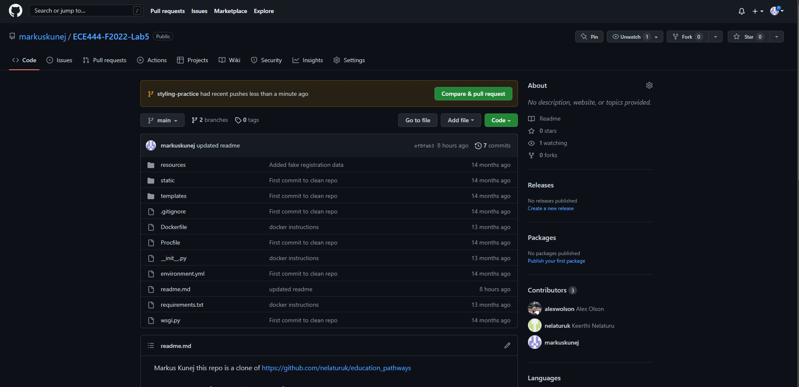
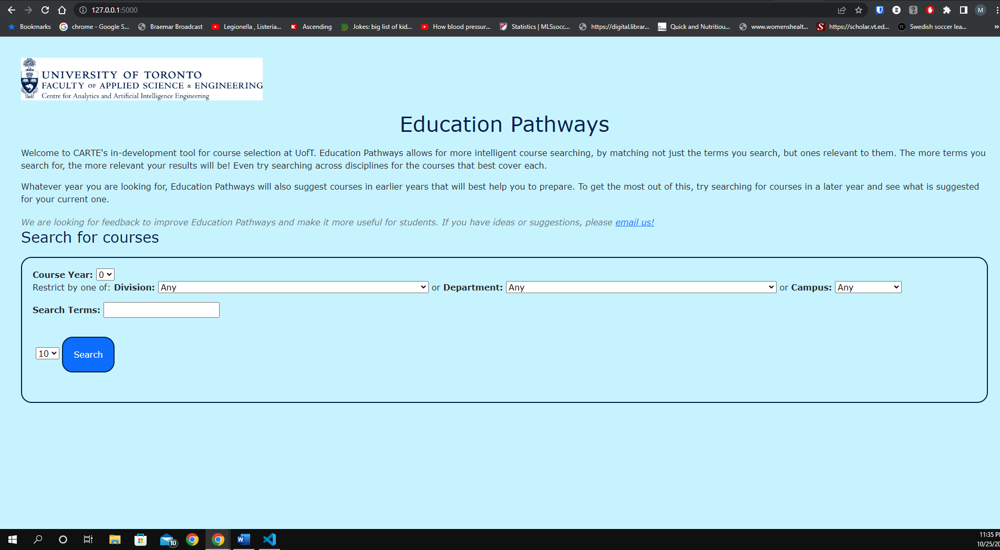
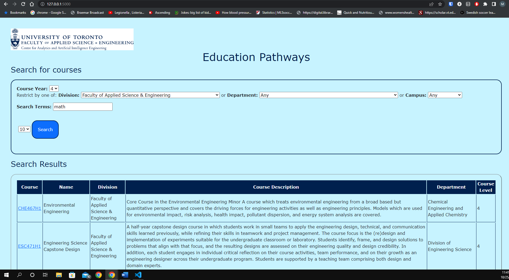
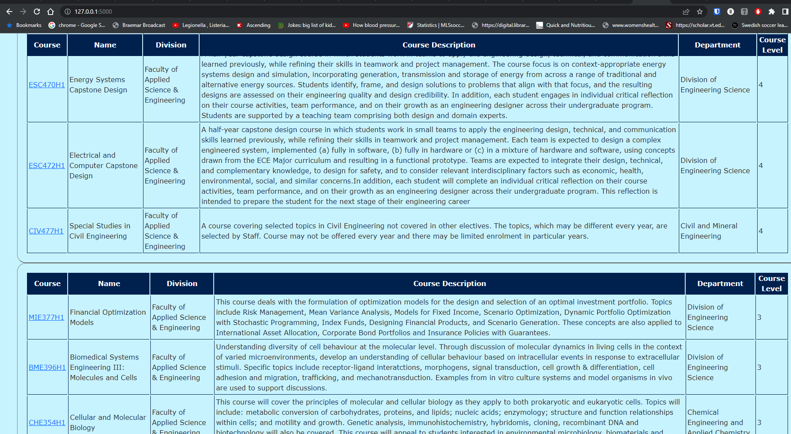
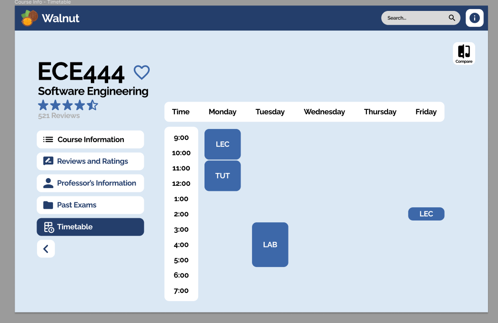
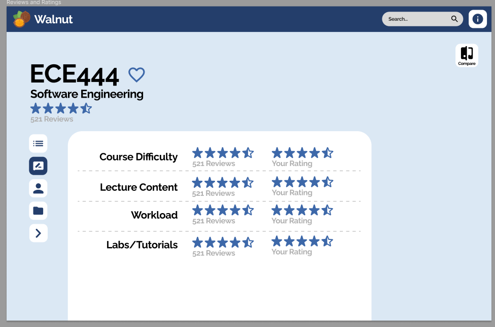
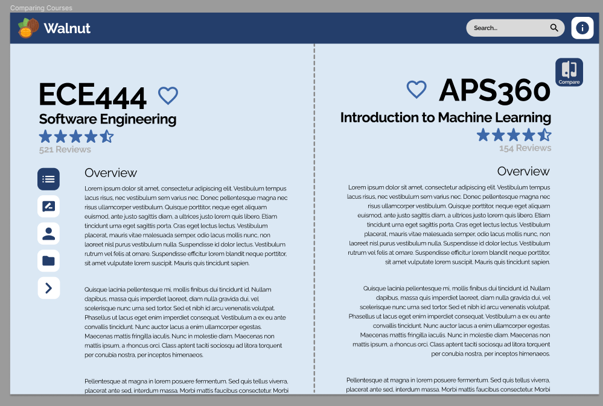

Markus Kunej
this repo is a clone of https://github.com/nelaturuk/education_pathways

# Activity 1

# Activity 2-5

## Home Page

## Search Form

## Results Table

# Activity 6

## User Story 1
As an upper year student, Bob needs to choose several technical electives, and wants to see whether they will conflict with each other. To satisfy this, each course page should have a schedule showing the available lecture, lab, and tutorial times.

### Front-End Prototype (this is the one I did)

## User Story 2
As a new student, Amy wants to quickly see the past student rating of a course. To satisfy this, each course should have a field where users can see past student ratings of the courses. 

### Front-End Prototype

## User Story 3
As a second-year international student, Justin wanted to compare similar courses to decide which one fits his interests more. To satisfy this, the system should have an option for users to see a side-by-side view of course information of two different courses, so they can be easily compared by the user.

### Front-End Prototype

# CARTE Education Pathways

## Description
Welcome to CARTE's in-development tool for course selection at UofT. Education Pathways allows for more intelligent course searching, by matching not just the terms you search, but ones relevant to them. The more terms you search for, the more relevant your results will be! Even try searching across disciplines for the courses that best cover each.

Whatever year you are looking for, Education Pathways will also suggest courses in earlier years that will best help you to prepare. To get the most out of this, try searching for courses in a later year and see what is suggested for your current one.

We are looking for feedback to improve Education Pathways and make it more useful for students. If you have ideas or suggestions, please email us!

## Setup Instructions

### With Docker

## Repository files:

`./Procfile ./wsgi.py` *tells gunicorn how to run the program*

`./environment.yml  ./requirements.txt` *specifies python requirements for anaconda and pip respectively*

`./__init__.py` *main flask code*

`./readme.md` *this file*

`./resources:` *contains datasets used in the program*

`course_vectorizer.pickle df_processed.pickle`

`course_vectors.npz       graph.pickle`

`./static:` *contains any static elements of the webpage, in this case just the CARTE logo*
`CARTE_logo.jpg`

`./templates:` *contains flask templates for rendering HTML*

`_formhelpers.html course.html       index.html        results.html`
